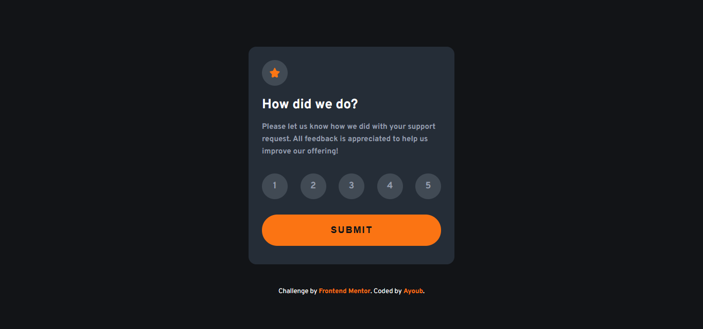
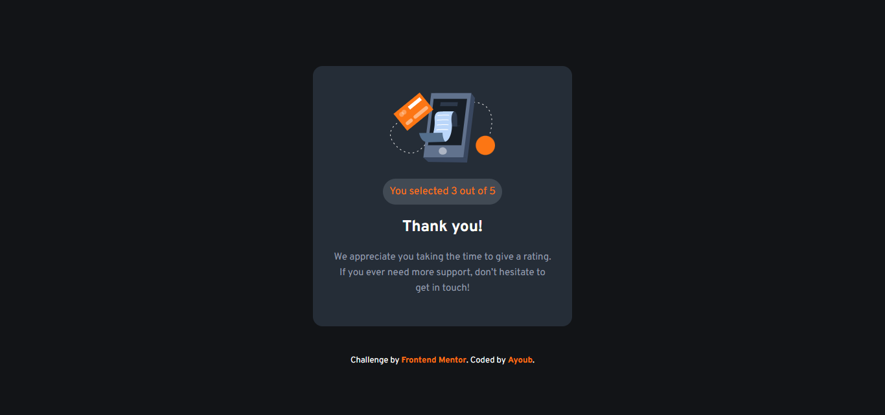
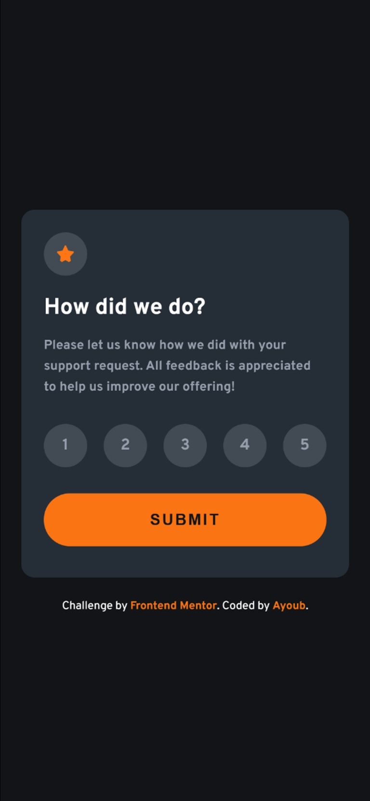

# Frontend Mentor - Interactive rating component solution

This is a solution to the [Interactive rating component challenge on Frontend Mentor](https://www.frontendmentor.io/challenges/interactive-rating-component-koxpeBUmI). Frontend Mentor challenges help you improve your coding skills by building realistic projects. 

## Table of contents

- [Overview](#overview)
  - [The challenge](#the-challenge)
  - [Screenshot](#screenshot)
  - [Links](#links)
- [My process](#my-process)
  - [Built with](#built-with)
  - [What I learned](#what-i-learned)
- [Author](#author)

## Overview

### The challenge

Users should be able to:

- View the optimal layout for the app depending on their device's screen size
- See hover states for all interactive elements on the page
- Select and submit a number rating
- See the "Thank you" card state after submitting a rating

### Screenshot






### Links

- Solution URL: [SOLUTION](https://www.frontendmentor.io/challenges/interactive-rating-component-koxpeBUmI)
- Live Site URL: [LIVE](https://ayoubsasi20.github.io/Interactive-rating-component/)

## My process

### Built with

- Semantic HTML5 markup
- CSS custom properties
- Flexbox
- Mobile-first workflow
- [React](https://reactjs.org/) - JS library
- [Vite](https://vitejs.dev/) - Frontend Tooling

### What I learned

This project was a fantastic leap from building static layouts to creating interactive web applications. Here are the key React concepts I implemented and solidified:

**1. State Management (`useState`):**
I learned how to manage multiple pieces of state within a single component. I used one state for tracking the selected rating and another for tracking whether the form was submitted.

```jsx
const [rating, setRating] = useState(null);
const [isSubmitted, setIsSubmitted] = useState(false);
```
2. Conditional Rendering:
I implemented conditional rendering to seamlessly switch between the rating card and the thank you card without needing separate HTML pages.

```jsx
{isSubmitted ? (
  <section className="greeting-card">
    {/* Thank you card content */}
  </section>
) : (
  <section className="card">
    {/* Rating card content */}
  </section>
)}
```
3. Dynamic Rendering & Styling with map():
Instead of hardcoding five similar buttons, I used an array map to dynamically generate the rating numbers. I also dynamically applied an active CSS class to the button that matches the current state, keeping the selected number highlighted.

```jsx
{[1, 2, 3, 4, 5].map((num) => (
  <div
    key={num}
    className={`rating ${rating === num ? "active" : ""}`}
    onClick={() => setRating(num)}
  >
    {num}
  </div>
))}
```
### Author
- Frontend Mentor - [@AyoubSasi20](https://www.frontendmentor.io/profile/AyoubSasi20)

